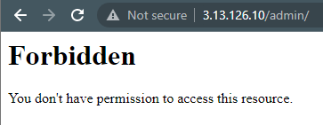
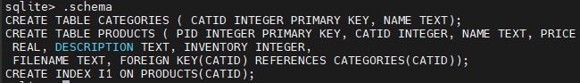
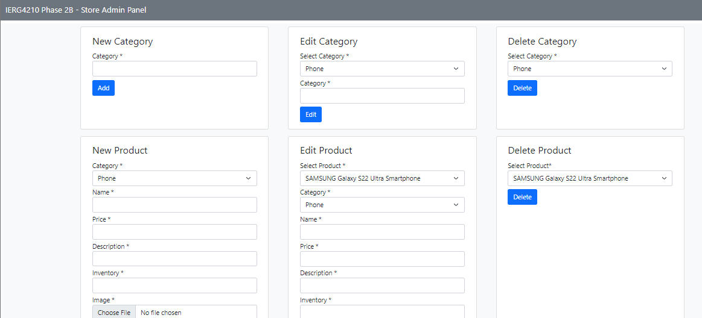
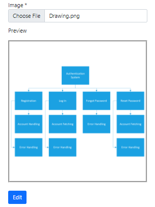

# IERG4210 Assignment Phase 2A & 2B

    

📚 Name: Lau Long Ching  
🗂️ SID: 1155127347

Please refer to https://github.com/leightonllc/IERG4210 for the git record.

## Phase 2A marking checklist
1. Instantiate a free Virtual Cloud Machine (Amazon EC2 recommended or other free VPS).  

 

2. Apply necessary security configurations. 

- Apply proper firewall settings to your VM: block all ports except 22, 80 and 443 only  

 
- Apply proper updates for the server software packages in a regular manner 
- Hide the versions of OS, Apache, and PHP in HTTP response headers  

 

- Do not display any PHP warnings and errors to the end users 
- Disable directory index in Apache  

 

3. Configure the VM so that your website is accessible at http://s1155127347.ierg4210.ie.cuhk.edu.hk 

- Apply for an elastic public IP, and ALWAYS associate it with the instantiated VM 
- Submit your elastic IP through the provided Google Form link before 5pm, Feb 13, 2022 
- TAs will then assign you a domain name and configure the DNS mapping for you 
- Upload all your pages to the server. They should then be accessible through:
  - http://3.13.126.10, or
  - http://s1155127347.ierg4210.ie.cuhk.edu.hk

## Phase 2B marking checklist

1. SQL: Create a database with the following structures  

 

- A table for categories 
  - Required columns: catid (primary key), name
  - Data: at least 2 categories of your choice
- A table for products (supposed to submit the list to PayPal, currently no function) 
  - Required columns: pid (primary key), catid, name, price, description
  - Data: at least 2 products for each category

2.  HTML, PHP & SQL: Create an admin panel http://3.13.126.10/admin/admin.php  

 

- Design several HTML forms to manage products in DB 
  - Dropdown menu to select catid according to its name 
  - Input fields for inputting name, price 
  - Textarea for inputting description 
  - File field for uploading an image (format: jpg/gif/png, size: <=10MB) 
    - For the file uploaded, store it with its name based on the unique lastInsertId() (or other reasonable ways)
- Design several HTML forms to manage categories in DB 

3. HTML, PHP, SQL: Update the main page created in Phase 1 

- Populate the category list from DB 
- Based on the category selected by the user, populate the corresponding product list from DB 
  - The catid=[x] is reflected as a query string in the URL

4. HTML, PHP & SQL: Update the product details page created in Phase 1 
- Display the details of a product based on its DB record 
- Display the inventory of a product based on its DB record 

5. Support of automatic image resizing for product images 
- When a large image is uploaded, the server will resize it and show a thumbnail image in the panel 
- On the main page, display thumbnails. On the product description page, display the larger image. 

6. Supporting HTML5 Drag-and-drop file selection in the admin panel 
- Create a dropping area that takes an image  

 

- Display a thumbnail (i.e. smaller width and height) if the dropped file is an image; reject it otherwise  

 
