# IERG4210 Assignment Phase 4

    

📚 Name: Lau Long Ching  
🗂️ SID: 1155127347

Please visit [http://3.13.126.10](http://3.13.126.10) or [https://secure.s31.ierg4210.ie.cuhk.edu.hk/](https://secure.s31.ierg4210.ie.cuhk.edu.hk/) to mark my assignment, thank you!

## Phase 3 marking checklist
1. No XSS Injection and Parameter Tampering Vulnerabilities in the whole website  

- [UI Enhancement Only] Proper and vigorous client-side input restrictions for all forms 

 

- Proper and vigorous server-side input sanitizations and validations for all forms 

 

- Proper and vigorous context-dependent output sanitizations 

 

 
2. Mitigate SQL Injection Vulnerabilities in the whole website  

- Apply parameterized SQL statements with the PDO library  

 

3. Mitigate CSRF Vulnerabilities in the whole website  

- Apply and validate secret nonces for every form  

 

- ALL forms must defend against Traditional and Login CSRF  

 

4. Authentication for Admin Panel

- Create a user table (or a separate DB with only one user table)   
  - Required columns: userid (primary key), email, password
  - Data:at least 2 users of your choice, 1 admin and 1 normal user (using admin flag)
  - Security: Passwords must be properly salted and hashed before storage

 

- Build a login page login.php that requests for email and password  

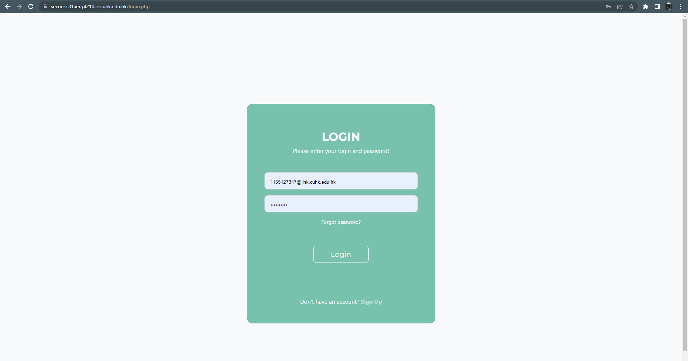 

  - Upon validated and authenticated, redirect the user to the admin panel or main page  
  - Indicate user name (or “guest” if not logged in) in your website  

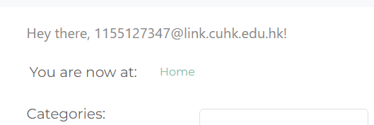 

  - Otherwise, prompt for errors (i.e. either email or password is incorrect)  

  

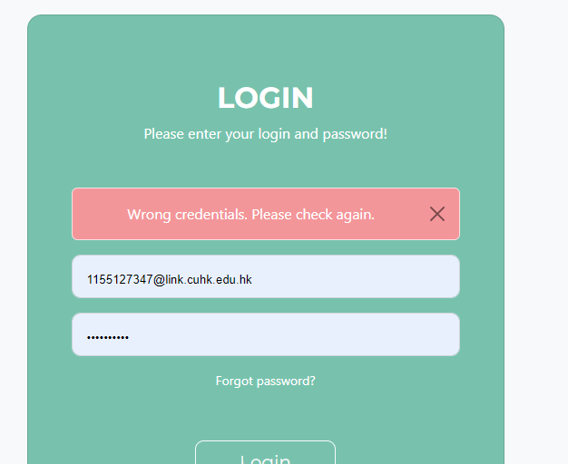 

  - A separated normal user login page is not compulsory  

- Maintain an authentication token using Cookies (with httpOnly)  
  - Cookie name: auth; value: a hashed token; property: httpOnly
  - Cookies persist after browser restart (i.e. 0 < expires < 3 days)

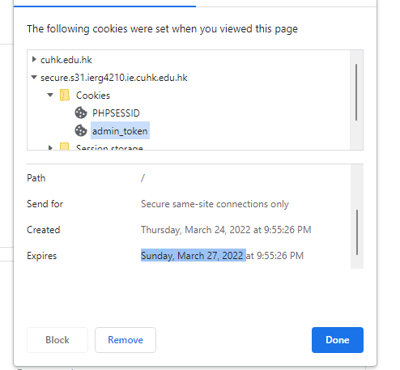 

  - No Session Fixation Vulnerabilities (rotate session id upon successful login)  

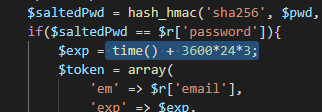 

  - Configure all authentication cookies to use the Secure and HttpOnly flags  

  

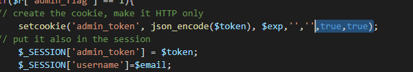 

- Validate the authentication token before revealing and executing admin features  
  - If successful, let admin users access the admin panel and execute admin features
  - Otherwise (e.g. empty or tampered token), redirect back to the login page or main page
  - Security: both admin.html and admin-process.php must validate the auth. token

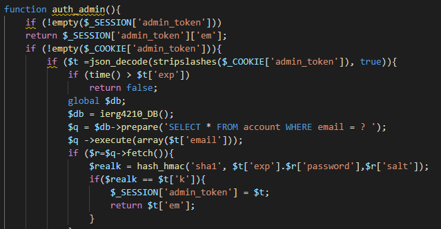 

- PHP & SQL: Provide a logout feature that clears the authentication token  

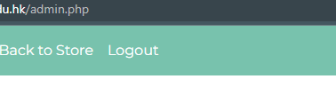 

- Supporting Change of Password  
  - Must validate the current password first
  - Logout user after the password is changed

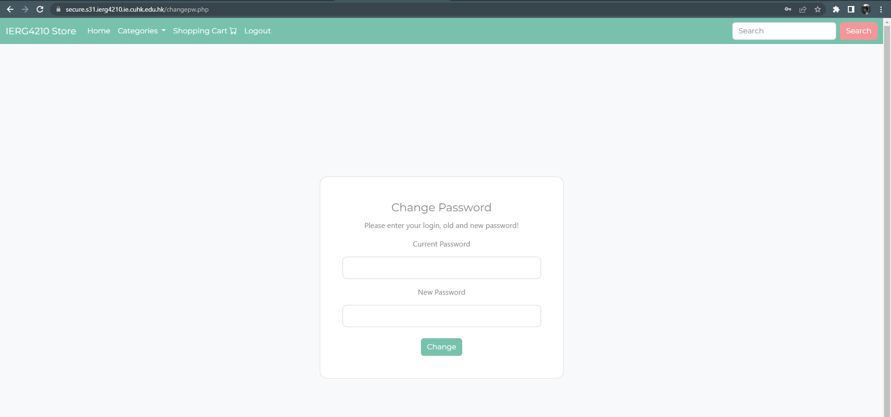 

5. All generated session IDs and nonces are not guessable throughout the whole assign.  

- e.g., the login token must not reveal the original password in plaintext  

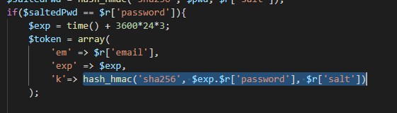 

- e.g., the CSRF nonce when applied in a hidden field must be random  

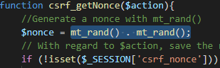 

6. Apply SSL certificate for secure.s[1-80].ierg4210.ie.cuhk.edu.hk  

- Certificate Application  
  - When generating a CSR, use CUHK as Organization Name
  - Apply for a 90-day free certificate at https://www.ssl.com/certificates/free/buy/ or https://letsencrypt.org/ (or others)

  

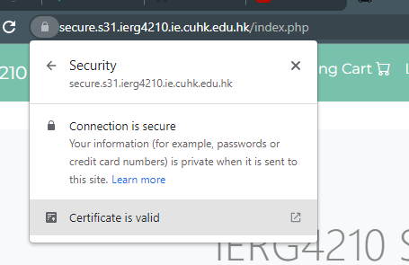 

- Certificate Installation  
  - Install the issued certificate and apply security configurations in Apache
  - Apply strong algorithms and secure cipher suites▪ Host admin panel at https://secure.s[1-80].ierg4210.ie.cuhk.edu.hk/admin.php
  - In the .htaccess  ( other ways are also OK ), redirect users to https website if come from http://[secure...] or http://[...]/admin.php 

  

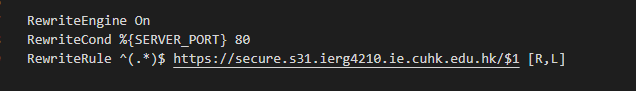 

