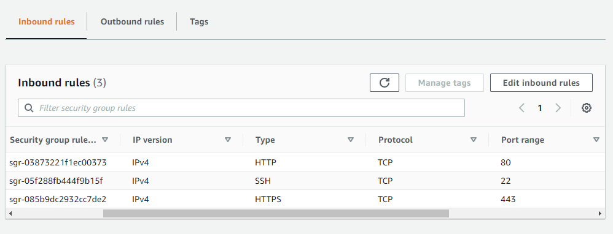
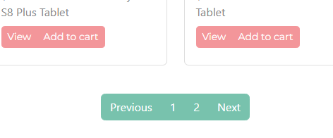

# IERG4210 Assignment Phase 3

    

📚 Name: Lau Long Ching  
🗂️ SID: 1155127347

Please click [here](https://gitfront.io/r/user-8114797/65077c3319b004230f7409482306b50059e13d64/IERG4210/) for the GitHub page.

Please visit [http://3.13.126.10](http://3.13.126.10) or [http://s1155127347.ierg4210.ie.cuhk.edu.hk](http://s1155127347.ierg4210.ie.cuhk.edu.hk) to mark my assignment, thank you!

## Phase 3 marking checklist
1. JS:  Dynamically  update# the shopping  list  

 

- When the add To Cart button  of  a  product  is  clicked, add  it  to  the  shopping  list 
  - Adding the same  product  twice  will  display  only  one  row  of  record 
- Once a product  is  added,
  - Users are  allowed  to  update  its quantity and  delete it  with  a  number  input,  or two  buttons  for  increment  and  decrement 
  - Store its pid and quantity in  the  browser’s localStorage 

 

  - Get the name and price over AJAX  (with pid as  input) 
  - Calculate  and  display  the  total  amount  at  the  client-side 
- Once the page  is  reloaded,  the shopping  list is  restored 
  - Page reloads  when  users  browse  another  category  or  visit  the  product  detail  page 
  - Populate  and  retrieve  the  stored  products  from  the localStorage 
- Supporting  pagination/AJAX  infinite  scroll  when  browsing  products  in  the  main  page 

 

\# The  whole  process  of shopping  list management  must be  done  without  a  page  load 

Note: As I face some technical difficulty in updating the shopping list automatically, there is a "Refresh" button. However, it only refreshes with AJAX, and there is NO page load.
